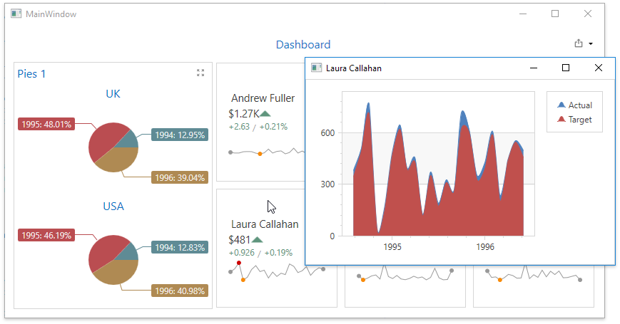

<!-- default badges list -->

<!-- default badges end -->

# Dashboard for WPF - How to handle a mouse click to obtain dashboard item data

This example demonstrates how to handle [DashboardControl.DashboardItemMouseUp](https://docs.devexpress.com/Dashboard/DevExpress.DashboardWpf.DashboardControl.DashboardItemMouseUp) event to obtain the 
clicked [CardDashboardItem](https://docs.devexpress.com/Dashboard/DevExpress.DashboardCommon.CardDashboardItem)'s data. The data are displayed in a chart in a secondary dialog window.

## Files to Review

* [MainWindow.xaml.cs](./CS/Dashboard_ClientDataCards_Wpf/MainWindow.xaml.cs) (VB: [MainWindow.xaml.vb](./VB/Dashboard_ClientDataCards_Wpf/MainWindow.xaml.vb))
* [MainWindow.xaml](./CS/Dashboard_ClientDataCards_Wpf/MainWindow.xaml) (VB: [MainWindow.xaml](./VB/Dashboard_ClientDataCards_Wpf/MainWindow.xaml))
* [DetailedChart.xaml](./CS/Dashboard_ClientDataCards_Wpf/DetailedChart.xaml) (VB: [DetailedChart.xaml](./VB/Dashboard_ClientDataCards_Wpf/DetailedChart.xaml))

## Documentation

- [Underlying and Displayed Data](https://docs.devexpress.com/Dashboard/400159/wpf-viewer/obtain-underlying-and-displayed-data)

## More Examples

- [How to obtain dashboard item's underlying data when the mouse hovers over it](https://github.com/DevExpress-Examples/wpf-dashboard-how-to-obtain-item-data-on-mouse-hover)
<!-- feedback -->
## Does this example address your development requirements/objectives?

 

(you will be redirected to DevExpress.com to submit your response)
<!-- feedback end -->
